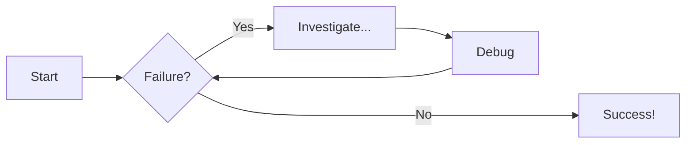
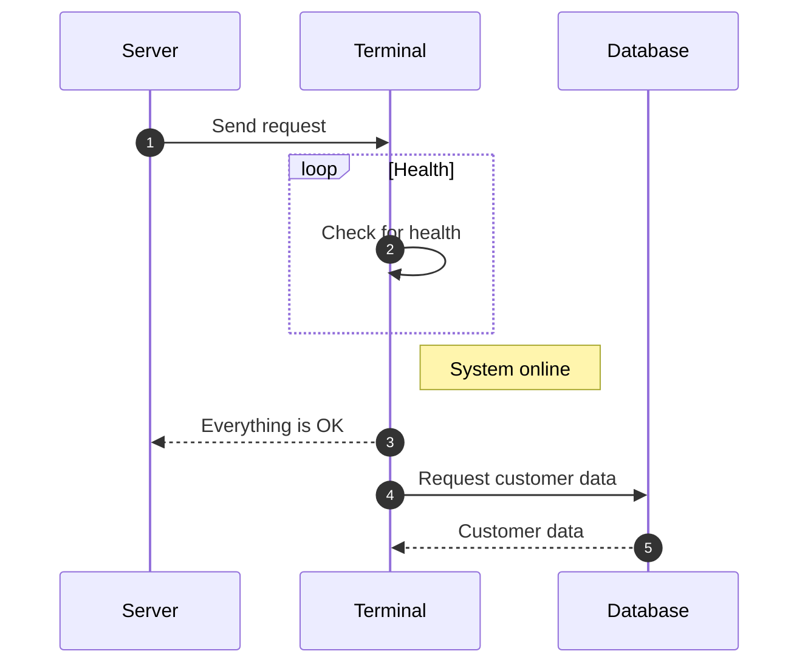

add `requirements.txt` and `pyproject.toml` to the root.

## Basic Text

=== "Format document"

    - Use `---` to write a horizontal rule.
    - Use EOF `\` to force a line break (never use trailing spaces).
    - Only use `&nbsp;` and `&emsp;` when you really need it.

=== "Format text"

    - This is __bold__ and _italic_. This is also **bold** and *italic*. This is __*bold and italic*__ combined.
    - This is ^^underlined^^, ~~strikethrough~~, ==highlighted== and {==inline highlighted==} in Markdown.
    - This is <ins>underlined</ins>, <del>strikethrough</del> and <mark>highlighted</mark> in HTML syntax.
    - This is superscript^s^ and subscript~s~ in Markdown. For example, H~2~O, CO~2~, A^T^P, mc^2^.
    - This is superscript<sup>s</sup> and subscript<sub>s</sub> in HTML syntax.
    - This is {--deleted text--} and this is {++added text++}. You can combine them into one {~~changed ~> text~~}.

=== "HTML entities"

    - Often used to display characters that have special meanings in HTML.
    - For example, &copy; &amp; &lt; &gt; &para; &reg; &trade; &sect; &euro; &pound; &aacute; &eacute; &ntilde; &ouml; &larr; &rarr; &uarr; &darr;

=== "Blockquotes"

    > Fringilla nisl. Donec accumsan interdum nisi, quis tincidunt felis sagittis eget tempus euismod.

    > Blandit adipiscing eu felis iaculis volutpat ac adipiscing accumsan faucibus.\
    > Vestibulum ante ipsum primis in faucibus lorem ipsum dolor sit amet nullam adipiscing eu felis.

=== "Keycodes"

    - Keyboard keys can be rendered with a simple syntax, e.g.
    - ++ctrl+alt+del++
    - ++ctrl+alt+del++
    - to be continued here

<small>
  :octicons-light-bulb-16:
  **Tip -** You can always use `<small>...</small>` or `<big>...</big>` to adjust font size when needed.
</small>


## Content Tabs

=== "Unordered list"

    - Nullam dignissim ultrices urna non auctor.
    - Duis mollis est eget nibh volutpat.
    - Duis efficitur accumsan nibh eu mattis.

=== "Code block"

    ```js title="code-helloworld.js" linenums="1" hl_lines="2"
    function main() {
        console.log("Hello world!");
    }
    ```

=== "Plain text"

    Basically everything can be wrapped into a content tab for readability.

    In most cases, content tabs, callouts, lists and many others can all be nested within each other.


## Lists and Tables

=== "Unordered list"

    - Nullam dignissim ultrices urna non auctor.
        * Duis mollis est eget nibh volutpat.
        * Duis efficitur accumsan nibh eu mattis.
    * Ante turpis integer aliquet porttitor.

=== "Ordered list"

    1. Nullam dignissim ultrices urna non auctor.
        1. Duis mollis est eget nibh volutpat.
        2. Duis efficitur accumsan nibh eu mattis.
    2. Ante turpis integer aliquet porttitor.

=== "Task list"

    - [x] Nullam dignissim ultrices urna non auctor.
        - [ ] Duis mollis est eget nibh volutpat.
        - [x] Duis efficitur accumsan nibh eu mattis.
    - [ ] Ante turpis integer aliquet porttitor.

=== "Simple Table"

    First Header | Second Header | Third Header
    ------------ | ------------- | ------------
    Content Cell 6 | Content Cell 2  | Content Cell 4
    Content Cell 3 | Content Cell 5  | Content Cell 1

=== "Aligned Table"

    First Header | Second Header | Third Header
    :----------- |:-------------:| -----------:
    Left         | Center        | Right
    Left         | Center        | Right

???+ tip

    A table must be surrounded by blank lines. There must be a blank line before and after the table.\
    By default, tables are also sortable by columns, but don't do it on large tables.

    For more complex tables that need custom styling, consider embedding HTML directly into markdown.\
    If there's a pattern to follow, `jinja2` can generate it for you. For example, this [HTML table](/home/life-a4.md) is generated by this [Python script]() and is appended to the markdown file with automated Github actions.


## Math

Inline math must be enclosed in `$...$` or `\(...\)`

The homomorphism $f$ is injective if and only if its kernel is only the
singleton set $e_G$, because otherwise $\exists a,b\in G$ with $a\neq b$ such
that $f(a)=f(b)$. $5x - 3y + 6z - 7$ where $d=\sqrt{y^{2} + z^{2}} = \sqrt{1/3}$. Note that the dollar sign can be escaped using `\$`, e.g., $p=\sqrt{p_{x}^{2} + p_{y}^{2}} = \$10.00$

Block math must be enclosed in `$$...$$`, `\[...\]` or `\begin{}...\end{}`. A block also must contain no empty lines and should be both preceded and followed by an empty line.

$$
\cos x=\sum_{k=0}^{\infty}\frac{(-1)^k}{(2k)!}x^{2k}
$$

\[
u = -\frac{xd}{z},\; v = -\frac{yd}{z},\; \frac{|d \vec{v} \cdot n|}{|n|} = 4\sqrt{3}
\]

\begin{bmatrix}
    1  &   0   &   0   &  0\\
    0  &  z/d  & -y/d  &  0\\
    0  &  y/d  &  z/d  &  0\\
    0  &   0   &   0   &  1
\end{bmatrix}

[MathJax](https://www.mathjax.org/) seems to accept the standard amsmath syntax.
Rows are terminated with `\\` and columns are separated by `&`

\begin{align*}
    R_{vx}(\theta _{vx}) &= \begin{bmatrix}
        1  &   0   &   0   &  0\\
        0  &  z/d  & -y/d  &  0\\
        0  &  y/d  &  z/d  &  0\\
        0  &   0   &   0   &  1
    \end{bmatrix},
    R_{vy}(\theta _{vy}) = \begin{bmatrix}
        d  &  0  & -x  &  0\\
        0  &  1  &  0  &  0\\
        x  &  0  &  d  &  0\\
        0  &  0  &  0  &  1
    \end{bmatrix}
\end{align*}

\begin{align*}
    \begin{pmatrix}
        c & s\\-s & c
    \end{pmatrix}
\end{align*}

For vectors just use a tuple, e.g. $\vec{v_1} = (1, 2, 0)$.

This is an inline matrix $r_{\omega} =$
$\begin{psmallmatrix}
    0 & x\\z & 0
\end{psmallmatrix}$.


## Colors

- HEX color `#0969DA`
- RGB color `rgb(9, 105, 218)`
- HSL color `hsl(212, 92%, 45%)`

inline text color:

<span class="icon-red">This is line red text</span>

<span class="icon-blue">This is a colored paragraph.</span>

Click on a tile to change the accent color:

<style>
  .md-typeset button[data-md-color-accent] > code {
    background-color: var(--md-code-bg-color);
    color: var(--md-accent-fg-color);
  }
</style>

<div class="mdx-switch">
  <button data-md-color-accent="red"><code>red</code></button>
  <button data-md-color-accent="pink"><code>pink</code></button>
  <button data-md-color-accent="purple"><code>purple</code></button>
  <button data-md-color-accent="deep-purple"><code>deep purple</code></button>
  <button data-md-color-accent="indigo"><code>indigo</code></button>
  <button data-md-color-accent="blue"><code>blue</code></button>
  <button data-md-color-accent="light-blue"><code>light blue</code></button>
  <button data-md-color-accent="cyan"><code>cyan</code></button>
  <button data-md-color-accent="teal"><code>teal</code></button>
  <button data-md-color-accent="green"><code>green</code></button>
  <button data-md-color-accent="light-green"><code>light green</code></button>
  <button data-md-color-accent="lime"><code>lime</code></button>
  <button data-md-color-accent="yellow"><code>yellow</code></button>
  <button data-md-color-accent="amber"><code>amber</code></button>
  <button data-md-color-accent="orange"><code>orange</code></button>
  <button data-md-color-accent="deep-orange"><code>deep orange</code></button>
</div>

<script>
  var buttons = document.querySelectorAll("button[data-md-color-accent]")
  buttons.forEach(function(button) {
    button.addEventListener("click", function() {
      var attr = this.getAttribute("data-md-color-accent")
      document.body.setAttribute("data-md-color-accent", attr)
      var name = document.querySelector("#__code_2 code span.l")
      name.textContent = attr.replace("-", " ")
    })
  })
</script>


## Emojis and Icons

While icons can be both colored and animated, emojis can only be animated but not colored as they already have colors.\
Use this [icon search tool](https://squidfunk.github.io/mkdocs-material/reference/icons-emojis/#search) to find out the shortcode for an icon or emoji.


=== "Default"

    :material-bell: :material-bell:{ .icon-blue } :material-bell-outline: :material-bell-outline:{ .icon-blue }

=== "Using `<big>`"

    <big>
        :material-bell: :material-bell:{ .icon-blue } :material-bell-outline: :material-bell-outline:{ .icon-blue }
    </big>

=== "Using `<small>`"

    <small>
        :material-bell: :material-bell:{ .icon-blue } :material-bell-outline: :material-bell-outline:{ .icon-blue }
    </small>

=== "Icon animated"

    :material-heart:{ .heart } &nbsp; :material-heart-outline:{ .heart }

=== "Icon colored and animated"

    :material-heart:{ .icon-red .heart } &nbsp; :material-heart-outline:{ .icon-red .heart }

=== "Emoji animated"

    :sparkling_heart:{ .heart } &nbsp; :four_leaf_clover:{ .heart } &nbsp; :palm_tree:{ .heart }


## Links
This is an [internal link](/index.md) that links to another Markdown document, here is [another internal link](/home/about-me.md) for example.

This is a [global anchor link](/opensdk/openusd/usd-basics.md#test) that links to a section (header) within another Markdown document. This is a [local anchor link](#images) that links to a section (header) within the current Markdown document. Generated anchor/section IDs follow the [same rules](https://docs.github.com/en/get-started/writing-on-github/getting-started-with-writing-and-formatting-on-github/basic-writing-and-formatting-syntax#section-links) that apply in Github markdown.

??? warning "Rules for relative paths"

    Make sure the path starts with a `/` so that it's relative to the `docs_dir` root. This applies regardless of whether the link is used as a URL or for embedding an image. If the path doesn't begin with a `/`, it will be interpreted as relative to the current markdown file. This makes it difficult to reference local resources, especially for files buried deep in the hierarchy. Note that it also leads to inconsistencies, as the same file could be referenced by many different paths.

!!! tip

    Links don't have to be authored inline, you can also define them in one place after a block.\
    This can be especially helpful if a link needs to be reused multiple times.


## Images

With the built-in extension, you can specify image attributes directly in Markdown with `{...}`.\
Normally you shouldn't need to specify `{ loading=lazy }` on images, as modern browsers by default will decide when to load the resource based on heuristics like network speed and device capabilities.

=== "Markdown"

    ```markdown title="Markdown"
    { width=60% }
    ```

    { width=60% }

=== "HTML"

    ```html title="HTML"
    
    ```

    


!!! tip

    Append this block to the image to add a caption:

    ```markdown
    /// caption
    This is my wife
    ///
    ```


/// caption
This is my wife
///

Use the `align` attribute to align images to the left or right, note that there is not a ==center== option.

=== ":material-arrow-left:"

    ```markdown title="Markdown"
    { align=left width=280 }
    ```

    { align=left width=280 }
    Lorem ipsum dolor sit amet, consectetur adipiscing elit. Nulla et euismod nulla. Curabitur feugiat, tortor non consequat finibus, justo purus auctor massa, nec semper lorem quam in massa. Lorem ipsum dolor sit amet, consectetur adipiscing elit. Nulla et euismod nulla. Curabitur feugiat, tortor non consequat finibus, justo purus auctor massa, nec semper lorem quam in massa. Curabitur feugiat, tortor non consequat finibus, justo purus auctor massa, nec semper lorem quam in massa. Lorem ipsum dolor sit amet, consectetur adipiscing elit. Nulla et euismod nulla. Curabitur feugiat, tortor non consequat finibus, justo purus auctor massa, nec semper lorem quam in massa.

=== ":material-arrow-right:"

    ```markdown title="Markdown"
    { align=right width=280 }
    ```

    { align=right width=280 }
    Lorem ipsum dolor sit amet, consectetur adipiscing elit. Nulla et euismod nulla. Curabitur feugiat, tortor non consequat finibus, justo purus auctor massa, nec semper lorem quam in massa. Lorem ipsum dolor sit amet, consectetur adipiscing elit. Nulla et euismod nulla. Curabitur feugiat, tortor non consequat finibus, justo purus auctor massa, nec semper lorem quam in massa. Curabitur feugiat, tortor non consequat finibus, justo purus auctor massa, nec semper lorem quam in massa. Lorem ipsum dolor sit amet, consectetur adipiscing elit. Nulla et euismod nulla. Curabitur feugiat, tortor non consequat finibus, justo purus auctor massa, nec semper lorem quam in massa.


## Annotations

<div class="annotate" markdown>
Annotations can be added to virtually all elements. It has a little marker(1)marked with the `annotate` class, and the content is listed below the block containing the marker(2).
</div>

1. I'm an annotation who can contain `code`, __formatted text__, images, ..., basically anything that can be expressed in Markdown.
2. For example, let me show you some code:
```cpp
#include <iostream>

int main()
{
    std::cout << "Hello World!";
    return 0;
}
```

To simplify the usage syntax, wrap the markdown block in `#!html <div class="annotate" markdown>...</div>`, then define all the annotations in a list. This works for everything except code blocks.

```html title="Annotations made easier"
<div class="annotate" markdown>
This is an annotation(1). This is another annotation(2).
</div>

1. Hello!
2. Howdy!
```

<div class="annotate" markdown>
This is an annotation(1). This is another annotation(2).
</div>

1. Hello!
2. Howdy!

Here for example we have annotations in callouts and content tabs, all using this trick.

<div class="annotate" markdown>
=== "Tab One"

    Lorem ipsum dolor(1)sit amet, consectetur adipiscing elit.

=== "Tab Two"

    Phasellus posuere in sem ut cursus(2).
</div>

1. Hello from content tab!
2. Howdy from content tab!

<div class="annotate" markdown>
!!! note "Phasellus posuere in sem ut cursus(1)"

    Lorem ipsum dolor sit amet, consectetur adipiscing elit. Nulla et
    euismod(2)nulla. Curabitur feugiat, tortor non consequat finibus, justo
    purus auctor massa, nec semper lorem quam in massa.
</div>

1. Hello from callout!
2. Howdy from callout!

For code blocks, code annotation has been globally enabled so don't worry about the `annotate` class or the `#!html <div>...</div>` block. Within a code block, annotations can only be placed within a line/block comment, like `#!cpp // (1)!`. The trailing exclamation mark `!` is used to strip the comment characters surrounding a code annotation.

```cpp title="Code annotations" hl_lines="8"
bool intersect(const Ray& ray, double& t) const
{
    Vec3 oc = ray.origin - center;
    double b = oc.dot(ray.direction);
    double c = oc.dot(oc) - radius * radius;
    double discriminant = b * b - c;
    if (discriminant > 0) {
        t = -b - std::sqrt(discriminant); // (1)!
        return t > 0;
    }
    return false;
}
```

1. I'm a friendly :handshake: annotation who wants to help explain a specific line of code.


## Buttons

buttons, buttons with icon


## Code Blocks

With our built-in extension, syntax highlight is also supported on inline code. Just prepend `#!py`, `#!sh` or whatever to the inline code, and you will see colors in no time. Recall that we also have inline comment (in grey).

- This is Python inline code `import os, sys` in plain form.
- This is Python inline code `#!py import os, sys` with syntax highlight.
- This is C++ inline code `constexpr int factorial(int n)` in plain form.
- This is C++ inline code `#!c++ constexpr int factorial(int n)` with syntax highlight.
- This is {>>an inline comment<<} which is {>>programming-language-agnostic<<}.

<div class="annotate" markdown>
Code blocks can have custom titles, annotations(1), line numbers(2)and highlighted lines(3). For example, this code block has options `#!css py title="bubble_sort.py" linenums="1" hl_lines="3-5"`. Don't know the lexer code for a particular programming language? The [pygments](https://pygments.org/docs/lexers/#) website got your back!
</div>

1. [annotations](#annotations)
2. user can optionally define a starting line number other than 1
3. line counts start at 1, regardless of the starting line number

```py title="bubble_sort.py" linenums="1" hl_lines="3-5"
def bubble_sort(items):
    for i in range(len(items)):
        for j in range(len(items) - 1 - i):
            if items[j] > items[j + 1]:
                items[j], items[j + 1] = items[j + 1], items[j]
```

Content of the code block can be imported from external sources as well, such as a local file or a URL. This feature requires some configuration on the [Snippets](https://facelessuser.github.io/pymdown-extensions/extensions/snippets/) extension. In practice though, I would be inclined not to do it due to the maintenance cost and the potential for things to break. In this case, I'd rather just use a permalink on Github instead. It does take one more click but has zero cost moving forward.


## Admonitions

Admonitions, aka _callouts_, are side content in the main document.

!!! note ""

    Callout without a title.

!!! example

    Callout with default title (will use name of the type qualifier).

!!! note "Custom Title"

    Callout with custom title.

??? tip "Collapsible callout (collapsed)"

    Lorem ipsum dolor sit amet. Nulla et euismod nulla.
    Curabitur feugiat, nec semper lorem quam in massa.

???+ tip "Collapsible callout (expanded)"

    Lorem ipsum dolor sit amet. Nulla et euismod nulla.
    Curabitur feugiat, nec semper lorem quam in massa.

There are 12 built-in callout types available.

??? note
    Lorem ipsum dolor sit amet. Nulla et euismod nulla.
??? abstract
    Lorem ipsum dolor sit amet. Nulla et euismod nulla.
??? info
    Lorem ipsum dolor sit amet. Nulla et euismod nulla.
??? tip
    Lorem ipsum dolor sit amet. Nulla et euismod nulla.
??? success
    Lorem ipsum dolor sit amet. Nulla et euismod nulla.
??? question
    Lorem ipsum dolor sit amet. Nulla et euismod nulla.
??? warning
    Lorem ipsum dolor sit amet. Nulla et euismod nulla.
??? failure
    Lorem ipsum dolor sit amet. Nulla et euismod nulla.
??? danger
    Lorem ipsum dolor sit amet. Nulla et euismod nulla.
??? bug
    Lorem ipsum dolor sit amet. Nulla et euismod nulla.
??? example
    Lorem ipsum dolor sit amet. Nulla et euismod nulla.
??? quote
    Lorem ipsum dolor sit amet. Nulla et euismod nulla.


!!! key "Custom admonition"

    Lorem ipsum dolor sit amet, consectetur adipiscing elit. Nulla et
    euismod nulla. Curabitur feugiat, tortor non consequat finibus, justo
    purus auctor massa, nec semper lorem quam in massa.


## Admonitions (inline)

=== "inline callout (:octicons-arrow-right-16:)"

    !!! tip inline end "Lorem ipsum"

        Lorem ipsum dolor sit amet, nulla et euismod nulla. Lorem ipsum dolor sit amet, nulla et euismod.

    ```
    !!! tip inline end "Lorem ipsum"

        Lorem ipsum dolor sit amet, nulla et euismod nulla...
    ```
    Use `inline end` to align to the right (for LTR languages).


=== "inline callout (:octicons-arrow-left-16:)"

    !!! tip inline "Lorem ipsum"

        Lorem ipsum dolor sit amet, nulla et euismod nulla. Lorem ipsum dolor sit amet, nulla et euismod.

    ```
    !!! tip inline "Lorem ipsum"

        Lorem ipsum dolor sit amet, nulla et euismod nulla...
    ```
    Use `inline` to align to the left (for RTL languages only).

__Important__: admonitions that use the `inline` modifiers _must_ be declared
prior to the content block you want to place them beside. If there's
insufficient space to render the admonition next to the block, the admonition
will stretch to the full width of the viewport, e.g., on mobile viewports.


## Flowcharts



## Sequence Diagrams



## More

``` yaml
theme:
  palette: # (1)!

    # Palette toggle for light mode
    - scheme: default
      toggle:
        icon: material/brightness-7 # (2)!
        name: Switch to dark mode

    # Palette toggle for dark mode
    - scheme: slate
      toggle:
        icon: material/brightness-4
        name: Switch to light mode
```

1.  Note that the `theme.palette` setting is now defined as a list.

2.  Enter a few keywords to find the perfect icon using our [icon search] and
    click on the shortcode to copy it to your clipboard:

    <div class="mdx-iconsearch" data-mdx-component="iconsearch">
      <input class="md-input md-input--stretch mdx-iconsearch__input" placeholder="Search icon" data-mdx-component="iconsearch-query" value="brightness" />
      <div class="mdx-iconsearch-result" data-mdx-component="iconsearch-result" data-mdx-mode="file">
        <div class="mdx-iconsearch-result__meta"></div>
        <ol class="mdx-iconsearch-result__list"></ol>
      </div>
    </div>

This configuration will render a color palette toggle next to the search bar.
Note that you can also define separate settings for [`primary`][palette.primary]
and [`accent`][palette.accent] per color palette.

The following properties must be set for each toggle:

<!-- md:option palette.toggle.icon -->

:   <!-- md:default none --> <!-- md:flag required -->
    This property must point to a valid icon path referencing any icon bundled
    with the theme, or the build will not succeed. Some popular combinations:

    * :material-brightness-7: + :material-brightness-4: – `material/brightness-7` + `material/brightness-4`
    * :material-toggle-switch: + :material-toggle-switch-off-outline: – `material/toggle-switch` + `material/toggle-switch-off-outline`
    * :material-weather-night: + :material-weather-sunny: – `material/weather-night` + `material/weather-sunny`
    * :material-eye: + :material-eye-outline: – `material/eye` + `material/eye-outline`
    * :material-lightbulb: + :material-lightbulb-outline: – `material/lightbulb` + `material/lightbulb-outline`

<!-- md:option palette.toggle.name -->

:   <!-- md:default none --> <!-- md:flag required -->
    This property is used as the toggle's `title` attribute and should be set to
    a discernable name to improve accessibility. It's rendered as a [tooltip].

  [palette.scheme]: #color-scheme
  [palette.primary]: #primary-color
  [palette.accent]: #accent-color
  [icon search]: ../reference/icons-emojis.md#search
  [tooltip]: ../reference/tooltips.md

you're :fontawesome-brands-youtube:{ style="color: #EE0F0F" }
__YouTube__

=== ":octicons-file-code-16: `docs/stylesheets/extra.css`"

    ``` css
    :root {
      --md-primary-fg-color:        #EE0F0F;
      --md-primary-fg-color--light: #ECB7B7;
      --md-primary-fg-color--dark:  #90030C;
    }
    ```

=== ":octicons-file-code-16: `mkdocs.yml`"

    ``` yaml
    extra_css:
      - stylesheets/extra.css
    ```

you can add an [additional style sheet] and tweak the values

  [additional style sheet]: ../customization.md#additional-css

### <!-- md:version --> – Version { data-toc-label="Version" }

### <!-- md:version insiders- --> – Version (Insiders)  { data-toc-label="Version (Insiders)" }

### <!-- md:default --> – Default value { #default data-toc-label="Default value" }

??? question "How to add plugins to the Docker image?"

    Material for MkDocs only bundles selected plugins in order to keep the size
    of the official image small. If the plugin you want to use is not included,
    you can add them easily:

    === "Material for MkDocs"

        Create a `Dockerfile` and extend the official image:

        ``` Dockerfile title="Dockerfile"
        FROM squidfunk/mkdocs-material
        RUN pip install mkdocs-macros-plugin
        RUN pip install mkdocs-glightbox
        ```

    === "Insiders"

        Clone or fork the Insiders repository, and create a file called
        `user-requirements.txt` in the root of the repository. Then, add the
        plugins that should be installed to the file, e.g.:

        ``` txt title="user-requirements.txt"
        mkdocs-macros-plugin
        mkdocs-glightbox
        ```

This is one[^1] and this is two[^2].

  [^1]:
    In 2016, Material for MkDocs started out as a simple theme for MkDocs, but
    over the course of several years, it's now much more than that – with the
    many built-in plugins, settings, and countless customization abilities,
    Material for MkDocs is now one of the simplest and most powerful frameworks
    for creating documentation for your project.

  [^2]:
    Note that improvements of existing features are sometimes released as
    patch releases, like for example improved rendering of content tabs, as
    they're not considered to be new features.

no copy code
``` { .sh .no-copy }
.
├─ docs/
│  └─ index.md
└─ mkdocs.yml
```

???+ tip "Recommended: [configuration validation and auto-complete]"

    In order to minimize friction and maximize productivity

<div class="grid cards" markdown>

-   :octicons-repo-template-24: &nbsp; __[Blog][blog-template]__

    ---

    Create a blog

-   :octicons-repo-template-24: &nbsp; __[Social cards][social-cards-template]__

    ---

    Create documentation with social cards

</div>

[blog-template]: https://github.com/mkdocs-material/create-blog
[social-cards-template]: https://github.com/mkdocs-material/create-social-cards

``` sh
mkdocs serve # (1)!
```

1.  If you have a large documentation project, it might take minutes until
    MkDocs has rebuilt all pages for you to preview.

<div class="mdx-columns" markdown>

- [:material-microsoft-azure-devops: Azure][Azure]
- [:simple-cloudflarepages: Cloudflare Pages][Cloudflare Pages]
- [:simple-digitalocean: DigitalOcean][DigitalOcean]
- [:material-airballoon-outline: Fly.io][Flyio]
- [:simple-netlify: Netlify][Netlify]
- [:simple-vercel: Vercel][Vercel]
- [:simple-codeberg: Codeberg Pages][Codeberg Pages]
- [:simple-scaleway: Scaleway][Scaleway]

</div>

  [GitLab Pages]: https://gitlab.com/pages
  [GitLab CI]: https://docs.gitlab.com/ee/ci/
  [masked custom variables]: https://docs.gitlab.com/ee/ci/variables/#create-a-custom-variable-in-the-ui
  [default branch]: https://docs.gitlab.com/ee/user/project/repository/branches/default.html
  [Azure]: https://bawmedical.co.uk/t/publishing-a-material-for-mkdocs-site-to-azure-with-automatic-branch-pr-preview-deployments/763
  [Cloudflare Pages]: https://deborahwrites.com/guides/deploy-mkdocs-material-cloudflare/
  [DigitalOcean]: https://deborahwrites.com/guides/deploy-mkdocs-material-digitalocean-app-platform/
  [Flyio]: https://documentation.breadnet.co.uk/cloud/fly/mkdocs-on-fly/
  [Netlify]: https://deborahwrites.com/projects/deploy-host-docs/deploy-mkdocs-material-netlify/
  [Vercel]: https://deborahwrites.com/guides/deploy-mkdocs-material-vercel/
  [Codeberg Pages]: https://andre601.ch/blog/2023/11-05-using-codeberg-pages/
  [Scaleway]: https://www.scaleway.com/en/docs/tutorials/using-bucket-website-with-mkdocs/

### Overriding blocks <small>recommended</small> { #overriding-blocks data-toc-label="Overriding blocks" }

<figure markdown>

| Browser                              | Version | Release date |         |        |      Usage |
| ------------------------------------ | ------: | -----------: | ------: | -----: | ---------: |
|                                      |         |              | desktop | mobile |    overall |
| :fontawesome-brands-chrome: Chrome   |     49+ |      03/2016 | 25.65%  | 38.33% |     63.98% |
| :fontawesome-brands-safari: Safari   |     10+ |      09/2016 |  4.63%  | 14.96% |     19.59% |
| :fontawesome-brands-edge: Edge       |     79+ |      01/2020 |  3.95%  |    n/a |      3.95% |
| :fontawesome-brands-firefox: Firefox |     53+ |      04/2017 |  3.40%  |   .30% |      3.70% |
| :fontawesome-brands-opera: Opera     |     36+ |      03/2016 |  1.44%  |   .01% |      1.45% |
|                                      |         |              |         |        | __92.67%__ |

  <figcaption markdown>

Browser support matrix sourced from [caniuse.com].[^1]

  </figcaption>
</figure>

* [Basics](blogs/basic.md) (20 min) <br/>
  covers the basics of setting up a blog, including post metadata.
* [Navigation, pagination, multiple authors](blogs/navigation.md) (30 min)<br/>
  describes how to make it easier for your readers to find content.
* [Engagement and dissemination](blogs/engage.md) (30 min)<br/>
  walks you through ways of increasing engagement with your content.

[:octicons-repo-template-24: Template Repository](https://github.com/mkdocs-material/create-blog)

``` diff
@@ -41,21 +40,10 @@
   
   <div class="md-footer-meta md-typeset">
     <div class="md-footer-meta__inner md-grid">
-      <div class="md-footer-copyright">
-        
-          <div class="md-footer-copyright__highlight">
-            {{ config.copyright }}
-          </div>
-        
-        
-          Made with
-          <a href="https://squidfunk.github.io/mkdocs-material/" target="_blank" rel="noopener">
-            Material for MkDocs
-          </a>
-        
-        {{ extracopyright }}
-      </div>
-      
+      
+      
+        
+      
     </div>
   </div>
 </footer>
```

<div class="grid cards" markdown>

- :fontawesome-solid-earth-americas: __[Language]__ – Choose out of the 60+ supported languages or add a new one
- :material-page-layout-sidebar-left: __[Navigation]__ – Create a clear, concise, and comprehensive navigation structure
- :material-page-layout-header: __[Header]__ – Customize the behavior of the header, add an announcement bar
- :material-page-layout-footer: __[Footer]__ – Add links to your social media profiles or websites in the footer
- :material-tab-search: __[Search]__ – Set up and configure search, running entirely in the user's browser
- :material-tag-plus-outline: __[Tags]__ – Categorize your pages with tags and group related pages

</div>

  [Language]: changing-the-language.md
  [Navigation]: setting-up-navigation.md
  [Header]: setting-up-the-header.md
  [Footer]: setting-up-the-footer.md
  [Search]: setting-up-site-search.md
  [Tags]: setting-up-tags.md

<div class="mdx-switch">
  <button data-md-color-scheme="default"><code>default</code></button>
  <button data-md-color-scheme="slate"><code>slate</code></button>
</div>

Use this button to turn on the waifu2x extension.
<script>
  var buttons = document.querySelectorAll("button[data-md-color-scheme]")
  buttons.forEach(function(button) {
    button.addEventListener("click", function() {
      document.body.setAttribute("data-md-color-switching", "")
      var attr = this.getAttribute("data-md-color-scheme")
      document.body.setAttribute("data-md-color-scheme", attr)
      var name = document.querySelector("#__code_0 code span.l")
      name.textContent = attr
      setTimeout(function() {
        document.body.removeAttribute("data-md-color-switching")
      })
    })
  })
</script>


## References

- [mkdocs](https://www.mkdocs.org/getting-started/)
- [mkdocs-material](https://squidfunk.github.io/mkdocs-material/getting-started/)
- https://github.com/mkdocs/catalog
- https://github.com/pawamoy/markdown-exec


