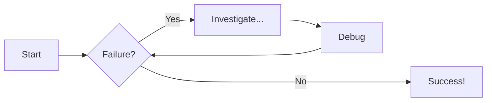
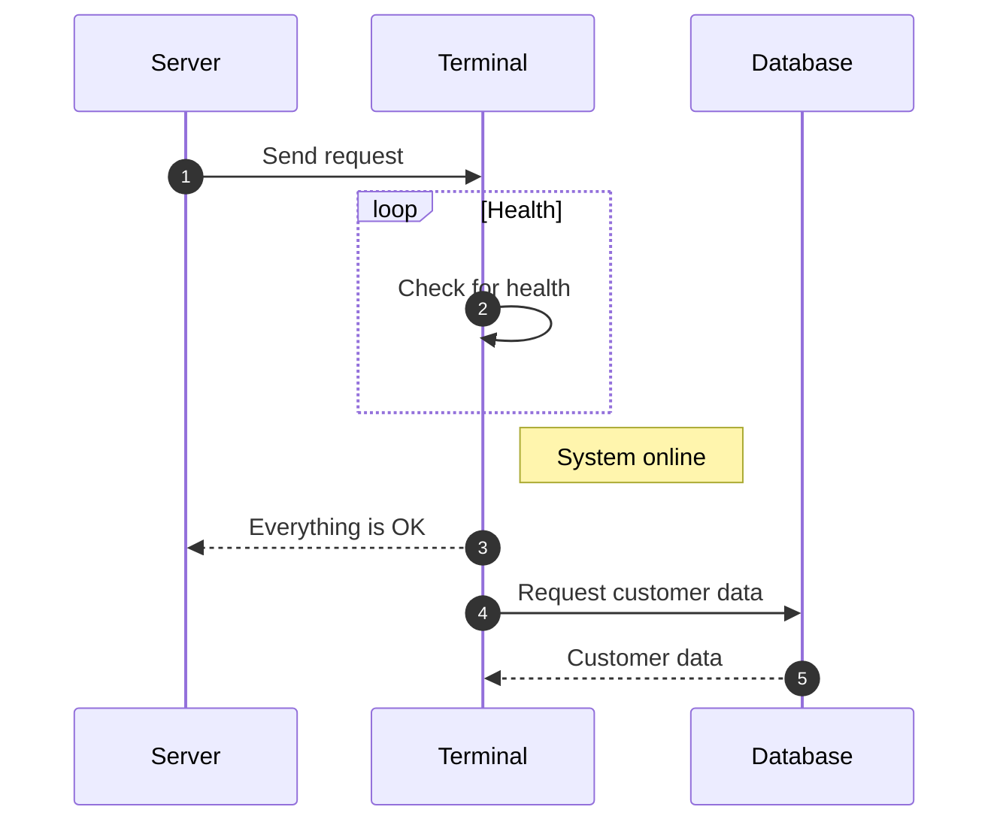

# Docs Template

Welcome to Atelier Mana Oasis! This is the workshop where project [Mana-Oasis](../../) will come to life.

## Source

- [mkdocs](https://www.mkdocs.org/getting-started/)
- [mkdocs-material](https://squidfunk.github.io/mkdocs-material/getting-started/)
- https://github.com/mkdocs/catalog
- https://github.com/pawamoy/markdown-exec

## Commands

* `mkdocs new [dir-name]` - Create a new project.
* `mkdocs serve` - Start the live-reloading docs server.
* `mkdocs build` - Build the documentation site.
* `mkdocs -h` - Print help message and exit.

## Emojis

:smile:

## Tables
A simple table looks like this:

First Header | Second Header | Third Header
------------ | ------------- | ------------
Content Cell | Content Cell  | Content Cell
Content Cell | Content Cell  | Content Cell

Specify alignment for each column by adding colons to separator lines:

First Header | Second Header | Third Header
:----------- |:-------------:| -----------:
Left         | Center        | Right
Left         | Center        | Right

Note that a table must be surrounded by blank lines. There must be a blank line before and after the table.

## Links
This is an [internal link](/bookmarks.md) that links to another Markdown document, the path is always relative to the `docs_dir` root. Here is [another internal link](/Cider/Cider1.md) for example.

You can also link to a section (header) within a Markdown document by using an [anchor link](/index.md#code-blocks). Section IDs are created from the text of a header. All text is converted to lowercase and any disallowed characters, including white-space, are converted to dashes.

## Images & Videos


## Code Blocks

```py title="add_numbers.py" linenums="1" hl_lines="2-4"
# Function to add two numbers
def add_two_numbers(num1, num2):
    return num1 + num2

# Example usage
result = add_two_numbers(5, 3)
print('The sum is:', result)
```

```js title="code-examples.md" linenums="1" hl_lines="2-4"
// Function to concatenate two strings
function concatenateStrings(str1, str2) {
  return str1 + str2;
}

// Example usage
const result = concatenateStrings("Hello, ", "World!");
console.log("The concatenated string is:", result);
```

## Content Tabs

=== "Plain text"

    This is some plain text

=== "Unordered list"

    * First item
    * Second item
    * Third item

=== "Ordered list"

    1. First item
    2. Second item
    3. Third item

=== "Python"

    ```py title="helloworld.py" linenums="1" hl_lines="4 5"
    def main():
        print("Hello world!")

    if __name__ == "__main__":
        main()
    ```

=== "JavaScript"

    ```js title="code-helloworld.js" linenums="1" hl_lines="1-3"
    function main() {
        console.log("Hello world!");
    }

    main();
    ```

## Admonitions (Callouts)
!!! note "Title of the callout"

    Lorem ipsum dolor sit amet, consectetur adipiscing elit. Nulla et euismod
    nulla. Curabitur feugiat, tortor non consequat finibus, justo purus auctor
    massa, nec semper lorem quam in massa.

## Collapsible Admonitions
??? info "Collapsible callout"

    Lorem ipsum dolor sit amet, consectetur adipiscing elit. Nulla et euismod
    nulla. Curabitur feugiat, tortor non consequat finibus, justo purus auctor
    massa, nec semper lorem quam in massa.

## Flowcharts



## Sequence Diagrams




